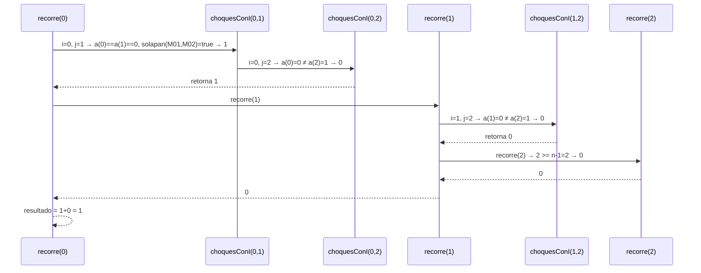
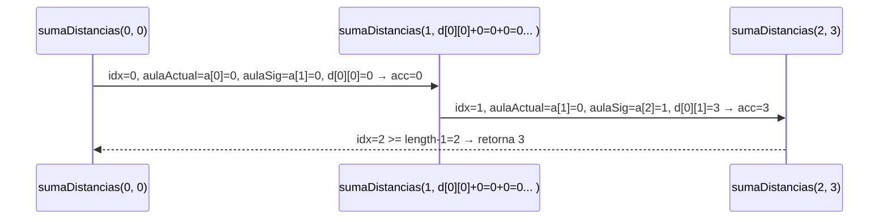
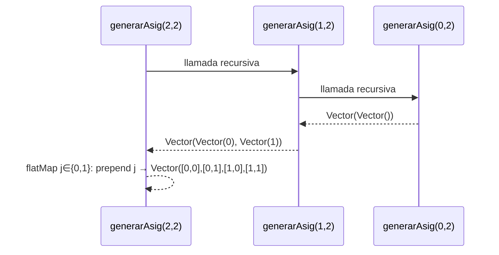
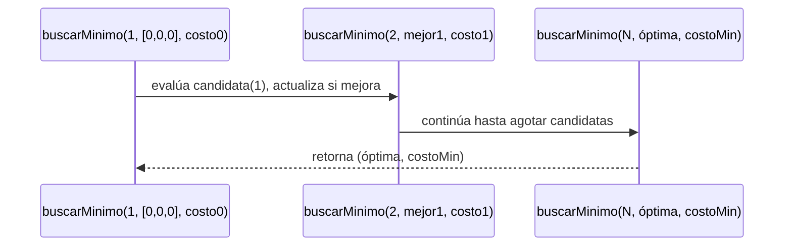

# Informe de proceso — Proyecto Final

**Curso:** Fundamentos de Programación Funcional y Concurrente  
**Integrantes:** (completar con nombres, códigos y correos)

---

## 1. `solapan`

Función no recursiva. Aplica directamente la condición matemática de solapamiento de intervalos:

$$\text{solapan}(c_1, c_2) \iff \text{ini}_{c_1} < \text{fin}_{c_2} \;\land\; \text{ini}_{c_2} < \text{fin}_{c_1}$$

---

## 2. `choques` — recursión lineal anidada

```scala
def choques(cursos: Cursos, a: Asignacion): Int = {
  def choquesConI(i: Int, j: Int): Int = ...
  def recorre(i: Int): Int = ...

  recorre(0)
}
```

**Ejemplo:** `cursos = [M01(4,8,25), M02(6,10,30), M03(12,16,20)]`, `a = [0,0,1]`

**Pila de llamadas de `recorre`:**



**Resultado:** `choques = 1` ✓

---

## 3. `capacidadFallida` — `foldLeft` sobre índices

Función de alto orden con `foldLeft`. Para cada índice `i`, si `a(i) >= 0` y `capAula < estCurso`, incrementa el acumulador.

**Traza para `a = [0,0,1]`, `aulas = [(E101,30),(E102,40)]`:**

| i | a(i) | cap | est | ¿falla? | acc |
|---|------|-----|-----|---------|-----|
| 0 | 0    | 30  | 25  | No      | 0   |
| 1 | 0    | 30  | 30  | No      | 0   |
| 2 | 1    | 40  | 20  | No      | 0   |

**Resultado:** `capacidadFallida = 0` ✓

---

## 4. `desperdicio` — `foldLeft` sobre índices

Similar a `capacidadFallida`. Suma `cap - est` cuando `cap >= est`.

**Traza para `a = [0,0,1]`:**

| i | cap | est | diff | acc |
|---|-----|-----|------|-----|
| 0 | 30  | 25  | 5    | 5   |
| 1 | 30  | 30  | 0    | 5   |
| 2 | 40  | 20  | 20   | 25  |

**Resultado:** `desperdicio = 25` ✓

---

## 5. `movilidad` — recursión de cola `sumaDistancias`

Primero ordena los cursos asignados por hora de inicio. Luego usa recursión de cola para sumar distancias consecutivas.

**Ejemplo:** `a = [0,0,1]`, orden por ini: M01(ini=4) → M02(ini=6) → M03(ini=12)



**Resultado:** `movilidad = 3` ✓

---

## 6. `costoAsignacion`

Combina las cuatro funciones anteriores con los pesos. No es recursiva.

**Para `a=[0,0,1]`, `w=(1000,100,1,2)`:**

$$CT = 1000 \cdot 1 + 100 \cdot 0 + 1 \cdot 25 + 2 \cdot 3 = 1031$$

---

## 7. `generarAsignaciones` — recursión lineal

**Especificación:** genera todos los vectores en $\{0,\ldots,m-1\}^n$.

**Traza para `n=2`, `m=2`:**



**Resultado:** 4 asignaciones = $2^2$ ✓

---

## 8. `asignacionOptima` — recursión de cola `buscarMinimo`

Genera todas las candidatas y las recorre con recursión de cola manteniendo la mejor asignación vista.

**Traza simplificada para el Ejemplo 1 del enunciado:**



La asignación `[0,1,0]` con costo 37 resulta ser la óptima para el Ejemplo 1.s una representación más eficiente del espacio de candidatas (generación lazy con `Stream` o `Iterator`) para evitar materializar $m^n$ vectores en memoria antes de evaluar el costo de cada uno. Esto permitiría escalar a $n > 10$ sin agotar la memoria del heap.